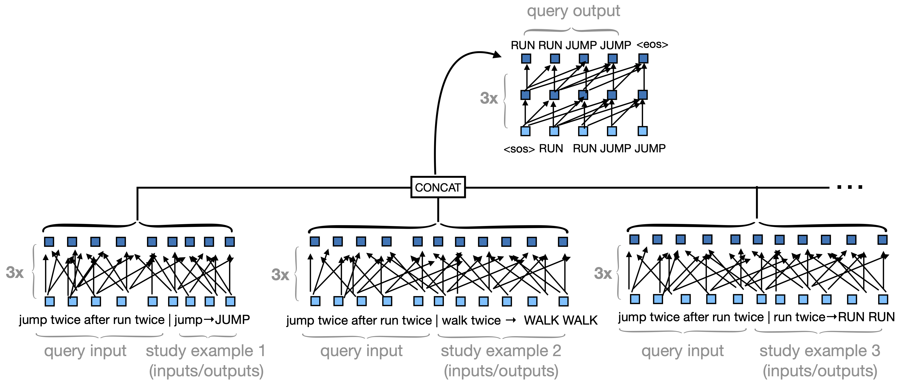

# Meta-Learning for Compositionality (MLC) for machine learning benchmarks

Meta-Learning for Compositionality (MLC) is an optimization procedure that encourages systematicity through a series of few-shot compositional tasks. This repository shows how to apply MLC to the [SCAN](https://github.com/brendenlake/SCAN) and [COGS](https://github.com/najoungkim/COGS) machine learning benchmarks.

**A [separate repository here](https://github.com/brendenlake/MLC) has code for applying MLC as a model of human behavioral responses, using a simpler architecture.**

**Note: Users can regard the acronym BIML as synonymous with MLC. The approach was renamed to MLC after the code was written.**

We strongly recommend you run the training and evaluations using a GPU (one Titan RTX used in paper).

This code accompanies the following submitted paper.
- Lake, B. M. and Baroni, M. (submitted). Human-like systematic generalization through a meta-learning neural network.   

You can email brenden AT nyu.edu if you would like a copy.



## Credits
This repo borrows from the excellent [PyTorch seq2seq tutorial](https://pytorch.org/tutorials/beginner/translation_transformer.html).

## Requirements
Python 3 with the following packages (install time within minutes):
torch (PyTorch), sklearn (scikit-learn), numpy, matplotlib

The specific versions used for development:
Python (3.7.9), PyTorch (1.10.1), sklean (0.24.2), numpy (1.21.5), matplotlib (3.3.2)

## Downloading pre-trained models
To get pre-trained models, you should download the following [zip file](https://cims.nyu.edu/~brenden/supplemental/BIML-large-files/BIML_ml_models.zip). Please extract `BIML_ml_models.zip` such that `out_models_scan` and `out_models_cogs` are sub-directories of the main repo and contain the model files `net_*.pt`. Records of the model output and performance numbers for the runs used in the paper are also available in this folder, as e.g., `net_*_eval_gen_lex.txt`.

## Evaluating models
Models are evaluated via their best responses to the test commands. We find the best response from the pre-trained MLC model using greedy decoding.

To evaluate a pre-trained model on the SCAN Add jump split,
```python
python eval.py  --max --episode_type addprim_jump_actions --dir_model out_models_scan --fn_out_model net_addprim_jump_actions_rep1.pt --verbose
```

To evaluate a pre-trained model on the COGS lexical generalization split,
```python
python eval.py  --max --episode_type cogs_gen_lex --dir_model out_models_cogs --fn_out_model net_cogs_train_targeted_rep1.pt --verbose
```


The full set of evaluation arguments can be viewed with when typing `python eval.py -h`:
```
optional arguments:
  -h, --help            show this help message and exit
  --fn_out_model FN_OUT_MODEL
                        *REQUIRED*. Filename for loading the model
  --dir_model DIR_MODEL
                        Directory for loading the model file
  --max_length_eval MAX_LENGTH_EVAL
                        Maximum generated sequence length (must be at least 50
                        for SCAN and 400 for COGS)
  --batch_size BATCH_SIZE
                        Maximum generated sequence length
  --episode_type EPISODE_TYPE
                        What type of episodes do we want? See datasets.py for
                        options
  --dashboard           Showing loss curves during training.
  --ll                  Evaluate log-likelihood of validation (val) set
  --max                 Find best outputs for val commands (greedy decoding)
  --debug
  --verbose             Inspect outputs in more detail
```

## Episode types
Please see `datasets.py` for the full set of options. Here are a few key episode types that can be set via `--episode_type`:

For MLC on SCAN:
- `simple_actions` : For meta-training and evaluating on SCAN Simple (IID) split.
- `addprim_jump_actions` : For meta-training and evaluating on SCAN Add jump split.
- `around_right_actions` : For meta-training and evaluating on SCAN Around right split.
- `opposite_right_actions` : For meta-training and evaluating on SCAN Opposite right split.
- `length_actions` : For meta-training and evaluating on SCAN Length split.

For MLC on COGS:
- `cogs_train_targeted` : Meta-training for COGS on all splits.
- `cogs_iid` : For evaluating on COGS Simple (IID) split.
- `cogs_gen_lex` : For evaluating on systematic lexical generalization split.
- `cogs_gen_struct` : for evaluating on systematic structural generalization split.

## Training models from scratch
Here are example of how to optimize MLC-Scale on SCAN and COGS. For training and evaluating on the SCAN Add jump split, 
```python
python train.py --episode_type addprim_jump_actions --fn_out_model net-BIML-scan-add-jump.pt
```
which after training will produce a file `out_models/net-BIML-scan-add-jump.pt`. For training and evaluating on the other SCAN splits, replace the `episode_type` with the options above.

To optimize for all COGS splits,
```python
python train.py --episode_type cogs_train_targeted --batch_size 40 --nepochs 300 --fn_out_model net-BIML-cogs.pt
```
which after training will produce a file `out_models/net-BIML-cogs.pt`.


The full set of training arguments can be viewed with `python train.py -h`:
```
optional arguments:
  -h, --help            show this help message and exit
  --fn_out_model FN_OUT_MODEL
                        *REQUIRED* Filename for saving model checkpoints.
                        Typically ends in .pt
  --dir_model DIR_MODEL
                        Directory for saving model files
  --episode_type EPISODE_TYPE
                        What type of episodes do we want? See datasets.py for
                        options
  --batch_size BATCH_SIZE
                        number of episodes per batch
  --batch_hold_update BATCH_HOLD_UPDATE
                        update the weights after this many batches (default=1)
  --nepochs NEPOCHS     number of training epochs
  --lr LR               learning rate
  --lr_end_factor LR_END_FACTOR
                        factor X for decrease learning rate linearly from
                        1.0*lr to X*lr across training
  --no_lr_warmup        Turn off learning rate warm up (by default, we use 1
                        epoch of warm up)
  --emb_size EMB_SIZE   size of embedding
  --nlayers_encoder NLAYERS_ENCODER
                        number of layers for encoder
  --nlayers_decoder NLAYERS_DECODER
                        number of layers for decoder
  --ff_mult FF_MULT     multiplier for size of the fully-connected layer in
                        transformer
  --dropout DROPOUT     dropout applied to embeddings and transformer
  --act ACT             activation function in the fully-connected layer of
                        the transformer (relu or gelu)
  --save_best           Save the "best model" according to validation loss.
  --save_best_skip SAVE_BEST_SKIP
                        Do not bother saving the "best model" for this
                        fraction of early training
  --resume              Resume training from a previous checkpoint
```
Note that the `save_best` options were not used in any benchmark experiment and should not be used in these use cases. SCAN does not have a validation set, and early stopping on the COGS validation set leads to poor performance.                       